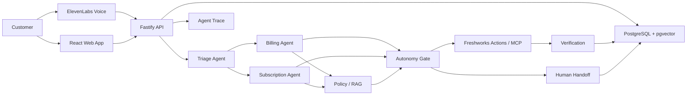

# ResolveX Architecture

## App flow

1. Customer opens ResolveX.
2. Customer speaks or types a request.
3. ElevenLabs handles voice input when selected.
4. The request enters the shared resolution workflow.
5. Triage Agent detects intents and decomposes tasks.
6. Triage routes billing work to Billing Agent and plan work to Subscription Agent.
7. Specialists retrieve customer context.
8. Specialists retrieve relevant policy/knowledge.
9. The autonomy gate checks evidence, policy, permission, and risk.
10. Authorized actions execute through Freshworks actions/MCP.
11. Verification checks the resulting customer state.
12. Successful verification resolves the request.
13. Unsafe, ambiguous, unsupported, or failed actions create a human handoff.
14. Agent Trace records the workflow.
15. Evaluation cases measure reliability and safety.

## System architecture



## Folder and file structure

```text
resolvex/
├── apps/
│   ├── web/          # Customer and operator UI
│   └── api/          # Orchestration, API, integrations, persistence
├── packages/
│   └── shared/       # Shared schemas, types, constants
├── scripts/          # Seed and evaluation commands
├── docs/             # Product, technical, and hackathon documentation
├── .env.example      # Required environment variables
├── package.json      # Workspace scripts and dependencies
└── README.md         # Setup and demo instructions
```

Detailed app structure:
```text
apps/web/src/{components,features,pages,lib,main.tsx}
apps/api/src/{agents,actions,knowledge,verification,handoff,traces,evaluations,db,server.ts}
packages/shared/src/{schemas,types,constants}
```

## Tech stack summary
- React + Vite
- TypeScript
- Tailwind CSS + shadcn/ui
- Node.js + Fastify
- PostgreSQL + pgvector
- Freshworks Agent Studio
- Freshworks AI Actions / MCP
- ElevenLabs Agents
- Zod
- Vitest
- Playwright
- Vercel

## Data flow between frontend, backend, and database

```text
Frontend
  │ HTTPS
  ▼
Fastify API
  ├── Agent workflow
  ├── Policy retrieval
  ├── Authorization
  ├── Freshworks adapter
  ├── Verification
  └── Handoff
       │
       ├── PostgreSQL
       │    ├── customers
       │    ├── transactions
       │    ├── subscriptions
       │    ├── conversations
       │    ├── agent_runs
       │    ├── tool_calls
       │    ├── verifications
       │    └── handoffs
       └── pgvector
            └── policy embeddings
```

Privileged Freshworks and ElevenLabs credentials never enter the browser.
